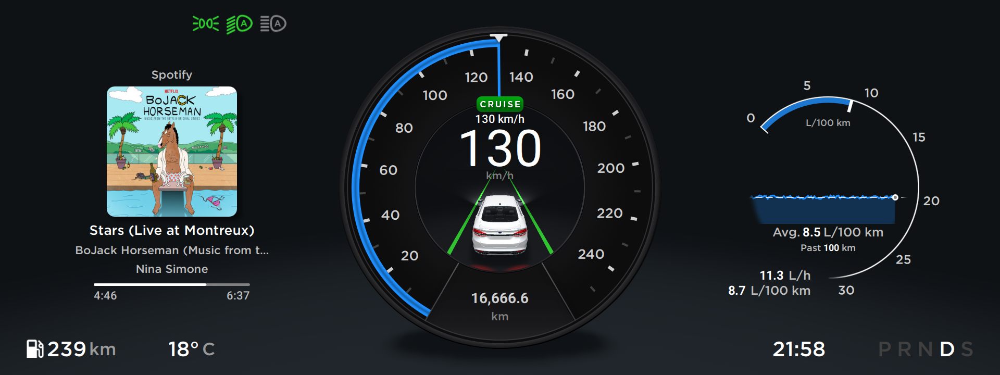
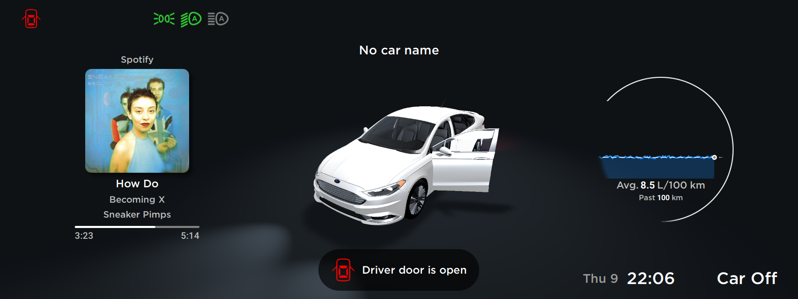
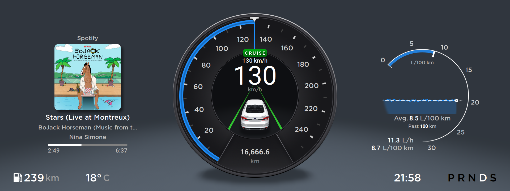
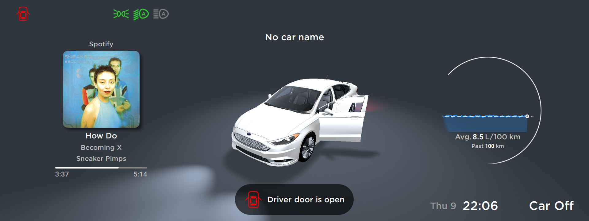

# Info
Custom Instrument Cluster written on Qt 6, currently works on Raspberry Pi Compute Module 4 with Raspbian.

To interact with CAN bus, i developed my custom gateway running on STM32+FreeRTOS.

Interaction with climate, car settings, and other systems without any problems, there are no DTCs in vehicle modules, full emulation of the original factory instrument cluster.

For displaying the navigation map and navigation instructions, i using my custom multimedia system, which is under development.

More information and videos coming soon.
# Demo video
[Link](https://youtu.be/i1HMDwnfqPg "Link")
# Screenshots

